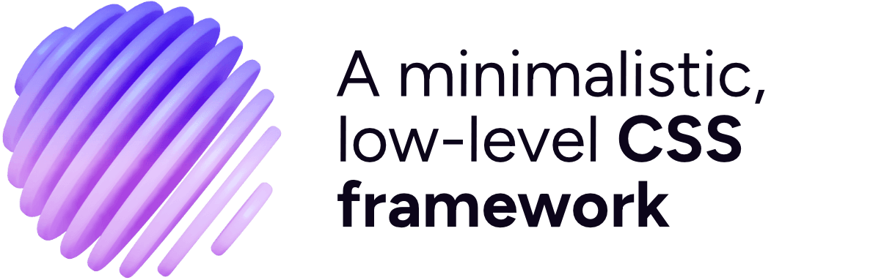

  <a href="https://sprucecss.com/">
     
    <picture>
      <source media="(prefers-color-scheme: light)" srcset="./.github/spruce-logo-dark.svg">
      <source media="(prefers-color-scheme: dark)" srcset="./.github/spruce-logo-light.svg">
      
    </picture>
     
  </a>

**Spruce CSS is an open-source, lightweight and modernish CSS design system, framework built on Sass. Give your project a solid foundation.**

## What is Spruce CSS?

- It is a Sass-based, small framework that operates with just a few utility classes.
- It takes advantage of the Sass members: variables, mixins, and functions.
- It embraces Sass modules, so it uses @use and namespacing for import.
- Spruce is a good choice if you prefer writing CSS instead of HTML. It uses just a few classic utility classes.
- It is a relatively small (~7kb gzipped) framework with a smaller learning curve. The codebase is small but can add more to any project with the available mixins and functions.
- It is that bunch of code you keep manually carrying from project to project.
- It is themeable. You can create different themes using CSS custom properties like a dark one.
- The generated CSS code is separated from the framework. You can use only the tools (variables, mixins, functions) in your project [without the generated styles](https://sprucecss.com/docs/elements/generators).
- Include just a few components. For UI, we have a separate project named [Spruce UI](/ui/getting-started/introduction), where you can find drop-in components.
- [It comes with dark-mode](https://sprucecss.com/docs/customization/themes) (or any theme mode) support. It uses CSS custom properties, so it isn’t that hard to create a new color theme.
- It doesn’t come with a classical grid system.

## How to start with Spruce?

Firstly, we suggest checking out the documentation, precisely the [installation page](https://sprucecss.com/docs/getting-started/installation).

There is nothing new if you previously used Sass unless you don’t know the newer [module system](https://sass-lang.com/blog/the-module-system-is-launched).

We made a [Spruce CSS Eleventy Starter](https://github.com/conedevelopment/sprucecss-eleventy-starter), a boilerplate starter template based on the popular static site generator 11ty. It includes a basic compile setup and, of course, Spruce CSS. You can find more information about it on GitHub.

## Documentation

For the complete documentation, please visit our site at [sprucecss.com](https://sprucecss.com). You can edit it at our [separate repository](https://github.com/conedevelopment/sprucecss-site).

### Getting Started

- [Introduction](https://sprucecss.com/docs/getting-started/introduction)
- [Installation](https://sprucecss.com/docs/getting-started/installation)
- [Structure and Code](https://sprucecss.com/docs/getting-started/structure-and-code)
- [Sass](https://sprucecss.com/docs/getting-started/sass)
- [Inclusivity and Accessibility](https://sprucecss.com/docs/getting-started/accessibility)
- [Internationalization](https://sprucecss.com/docs/getting-started/internationalization)
- [Print](https://sprucecss.com/docs/getting-started/print)
- [JS](https://sprucecss.com/docs/getting-started/js)
- [Contribution](https://sprucecss.com/docs/getting-started/contribution)
- [Appendix](https://sprucecss.com/docs/getting-started/appendix)

### Customization
- [Settings](https://sprucecss.com/docs/customization/settings)
- [Themes](https://sprucecss.com/docs/customization/themes)

### Sass
- [Variables](https://sprucecss.com/docs/sass/variables)
- [Mixins](https://sprucecss.com/docs/sass/mixins)
- [Functions](https://sprucecss.com/docs/sass/functions)

### Elements
- [Generators](https://sprucecss.com/docs/elements/generators)
- [Typography](https://sprucecss.com/docs/elements/typography)
- [Tables](https://sprucecss.com/docs/elements/tables)
- [Buttons](https://sprucecss.com/docs/elements/buttons)
- [Forms](https://sprucecss.com/docs/elements/forms)
- [Media](https://sprucecss.com/docs/elements/media)

## Components

  

    <a href="https://sprucecss.com/ui/getting-started/introduction">This collection of reusable user interfaces</a> aims to help you create more coherently with Spruce CSS.
  

  ### Components

  - [Accordion Card](https://sprucecss.com/ui/component/accordion-card)
  - [Accordion List](https://sprucecss.com/ui/component/accordion-list)
  - [Alert](https://sprucecss.com/ui/component/alert)
  - [Auth Form](https://sprucecss.com/ui/component/auth-form)
  - [Breadcrumb List](https://sprucecss.com/ui/component/breadcrumb-list)
  - [Container](https://sprucecss.com/ui/component/container)
  - [Cookie Consent](https://sprucecss.com/ui/component/cookie-consent)
  - [Invoice](https://sprucecss.com/ui/component/invoice)
  - [Pagination](https://sprucecss.com/ui/component/pagination)
  - [Post Author](https://sprucecss.com/ui/component/post-author)
  - [Post Card](https://sprucecss.com/ui/component/post-card)
  - [Preloader](https://sprucecss.com/ui/component/preloader)
  - [Site Navigation](https://sprucecss.com/ui/component/site-navigation)
  - [Skip Link](https://sprucecss.com/ui/component/skip-link)
  - [Theme Switcher](https://sprucecss.com/ui/component/theme-switcher)

  ### Sections

  - [Feature](https://sprucecss.com/ui/section/feature)
  - [Gallery](https://sprucecss.com/ui/section/gallery)
  - [Post Content](https://sprucecss.com/ui/section/post-content)
  - [Post Heading](https://sprucecss.com/ui/section/post-heading)
  - [Post List](https://sprucecss.com/ui/section/post-list)
  - [Site Footer](https://sprucecss.com/ui/section/site-footer)
  - [Site Header](https://sprucecss.com/ui/section/site-header)

  ### Pages

  - [Auth](https://sprucecss.com/ui/page/auth)
  - [Post](https://sprucecss.com/ui/page/post)

## Templates

  - **[Spruce Docs](https://github.com/conedevelopment/sprucecss-eleventy-documentation-template)** - A simple documentation template made with Eleventy.
  - **[Root](https://github.com/conedevelopment/sprucecss-root-admin-template)** - A straightforward administration template with standard views and lots of components.

## Contributing

Thank you for considering contributing to Spruce CSS! The [contribution guide](https://sprucecss.com/docs/getting-started/contribution/) can be found in the documentation.
